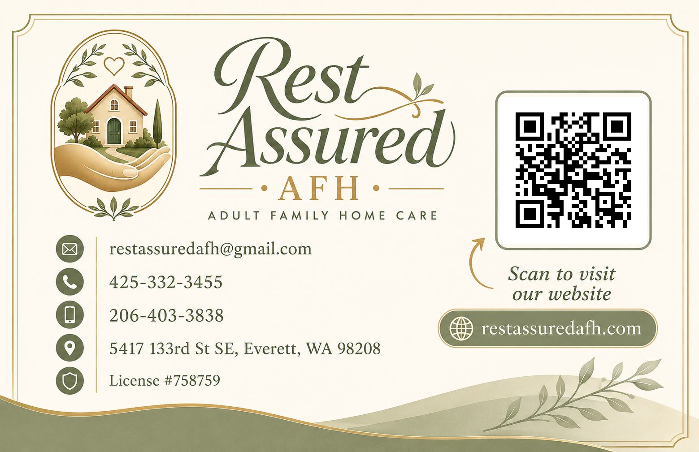
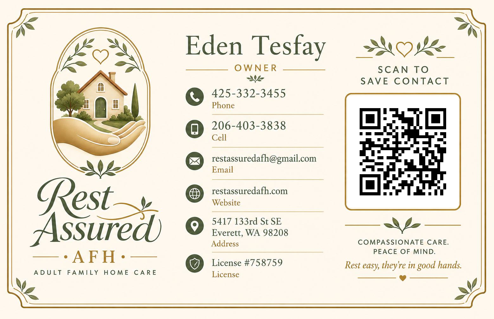

# Rest Assured AFH Website

Production static website for **Rest Assured AFH**, a licensed Adult Family Home in Everett, Washington.

The site presents the home, licensed nurse-led care approach, real home photos, contact options, local SEO foundation, and a save-contact workflow for business card QR codes.

## Live Site

[restassuredafh.com](https://restassuredafh.com/)

## Business Card Workflow

The project also includes matching business card assets with QR-driven contact flows. The front card points to the live website, while the back card points to the save-contact page.

<p align="center">
  
  
</p>

## Project Goals and Objectives

- Present Rest Assured AFH clearly and professionally for families researching senior care.
- Support local search visibility for Everett, Silver Firs, and nearby Snohomish County searches.
- Make contact easy through phone, email, location, QR, and vCard workflows.
- Keep the website fast, accessible, secure, and easy to maintain without a frontend framework.
- Deliver a dependency-light static site, with Google Fonts as the only external presentation dependency.
- Use Firebase Hosting and Cloudflare DNS for a zero-recurring-cost deployment model for the current static-site footprint.
- Preserve a reported Chrome Lighthouse baseline above 90 for Performance and full scores for Accessibility, Best Practices, and SEO.
- Connect offline and online touchpoints through business cards, QR codes, a branded save-contact page, and a downloadable vCard.
- Maintain a professional repository structure suitable for client handoff and portfolio review.

## Key Features

- Responsive static homepage.
- Real home photo gallery with lightbox behavior.
- Owner section for Eden Tesfay, a licensed nurse with 17+ years of healthcare experience.
- Services overview for personal care, medication assistance, memory care support, respite care, hospice support, meals/nutrition, and housekeeping/laundry.
- Local business SEO metadata and structured data.
- `robots.txt` and `sitemap.xml`.
- Save-contact page at `/save-contact/`.
- Downloadable vCard at `/downloads/contact.vcf`.
- Branded visitor-facing `404.html` page.
- Business card QR assets.

## Tech Stack

- HTML
- CSS
- JavaScript
- Static assets using optimized image formats where available
- Firebase Hosting
- GitHub Actions / Firebase Hosting GitHub integration
- Cloudflare DNS

The current site does not require a backend for its core public-facing experience.

## Deployment

The production site is deployed as a static website on Firebase Hosting.

Current deployment stack:

- GitHub is the source of truth for production files.
- Pull requests create Firebase Hosting preview deployments.
- Merges to `main` deploy to the Firebase Hosting live channel through GitHub Actions.
- `restassuredafh.com` is connected as the live Firebase Hosting custom domain.
- `www.restassuredafh.com` redirects to `https://restassuredafh.com/`.
- Cloudflare remains the DNS provider.
- Firebase Hosting records are currently DNS-only in Cloudflare so Firebase can manage HTTPS certificates directly.
- The previous home-hosted setup is kept only as a fallback/rollback option, not as the active public production origin.

See `docs/DEPLOYMENT.md` and `docs/SECURITY.md` for operational notes.

## Repository Structure

```text
.
|-- index.html
|-- 404.html
|-- style.css
|-- script.js
|-- save-contact/
|-- downloads/
|-- assets/
|-- business_card/
|-- docs/
|-- robots.txt
`-- sitemap.xml
```

## Documentation

Project documentation is kept in `docs/`:

- `docs/TECHNICAL_DOCUMENTATION.md`
- `docs/PROJECT_HISTORY.md`
- `docs/DEPLOYMENT.md`
- `docs/SEO_PLAN.md`
- `docs/MAINTENANCE.md`
- `docs/SECURITY.md`
- `docs/TODO.md`
- `docs/ai/`

## Status

Documentation cleanup, Firebase Hosting migration, GitHub-based deployment, custom-domain migration, and final mobile/404 polish are complete.

Current follow-up priorities are post-migration cleanup, SEO planning, local SEO implementation, and later design polish.
